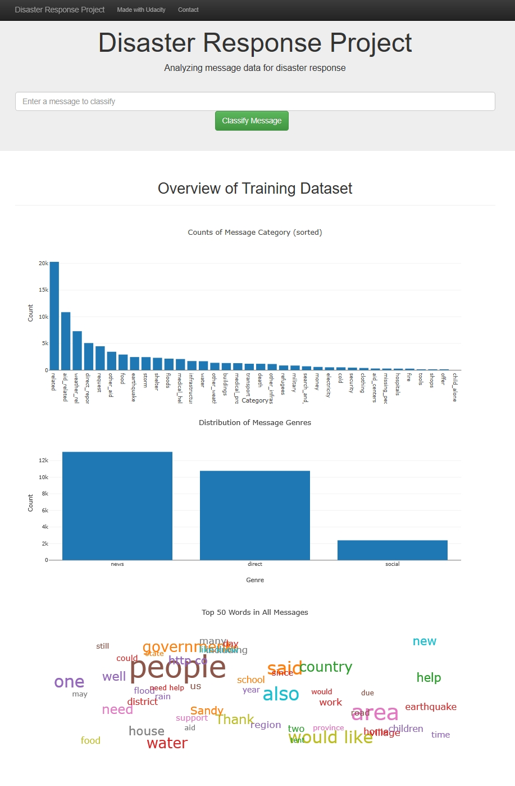
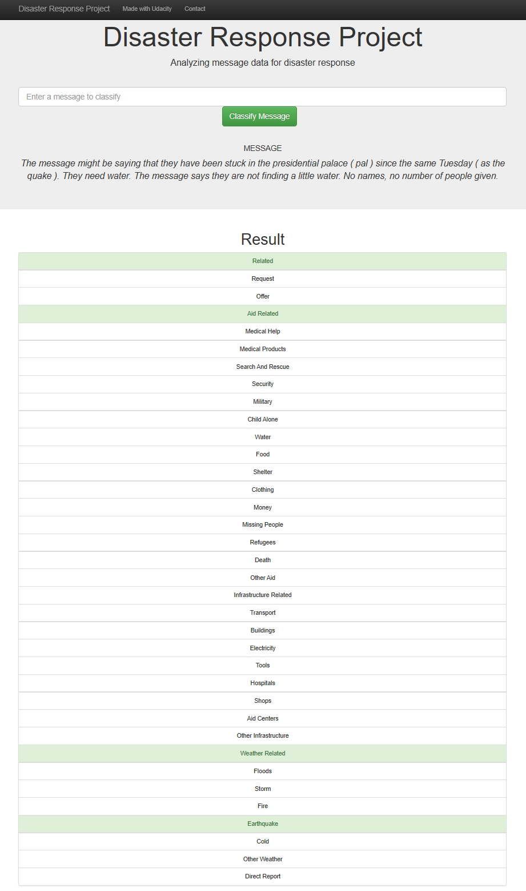

# Disaster Response Pipeline Project

- [Table of Contents](#Table_of_Contents)
  - [1. Background](#1-background)
  - [2. Installation](#2-installation)
  - [3. File Descriptions](#3-file-descriptions)
  - [4. Instructions](#4-Instructions)
  - [5. Screenshots](#5-Screenshots)
  - [6. Acknowledgements](#6-Acknowledgements)

## 1. Background
This project is to analyze disaster data from Figure Eight to build a model for an API that classifies disaster messages.

A machine learning pipeline was created to categorize the disaster messages so that the messages can be sent to appropriate disaster relief agencies.

A [web app](https://dj-disaster-response-webapp.herokuapp.com/) where an emergency worker can input a new message and get classification results in several categories was developed. The web app  also displays visualizations of the data.

## 2. Installation

The code was developed using the Anaconda distribution of Python, versions 3.8.1. Python libraries used are `numpy`, `pandas`, `sqlalchemy`, `plotly`, `sklearn`, `nltk`, `pickle`, `utility`, `flask`, `wordcloud`

## 3. File Descriptions

In the Project Workspace, you'll find a data set containing real messages that were sent during disaster events.

* `app`
  * `templates`
    * `master.html` - main page of web app
    * `go.html` - classification result page of web app
  * `utility.py` - customized transformers and functions
  * `run.py` - Flask file that runs app

* `data`
  * `disaster_categories.csv` - data to process
  * `disaster_messages.csv` - data to process
  * `ETL_Pipeline_Preparation.ipynb` - notebook to explore the datasets and prepare ETL pipeline
  * `process_data.py` - ETL pipeline to clean and store data into a SQLite database
  * `DisasterResponse.db` - database to save clean data to

* `models`
  * `train_classifier.py` - Use ML pipeline to train and save the trained model in a pickle file
  * `classifier.pkl` - saved model
  * `ML_Pipeline_Preparation.ipynb` - notebook to try ML models and prepare ML pipeline
  * `utility.py` - customized transformers and functions

* `README.md`

## 4. Instructions:
1. Run the following commands in the project's root directory to set up your database and model.

    - To run ETL pipeline that cleans data and stores in database  
      `python data/process_data.py data/disaster_messages.csv data/disaster_categories.csv data/DisasterResponse.db`

    - To run ML pipeline that trains classifier and saves  
      `python models/train_classifier.py data/DisasterResponse.db models/classifier.pkl`

2. Run the following command in the app's directory to run your web app.  
    `python run.py`

3. Go to http://0.0.0.0:3001/

## 5. Screenshots
### 5a. [Home Page](https://dj-disaster-response-webapp.herokuapp.com/)

### 5b. Message Categories

## 6. Acknowledgements

Special thanks to [Figure Eight](https://www.figure-eight.com/) for providing the dataset.
